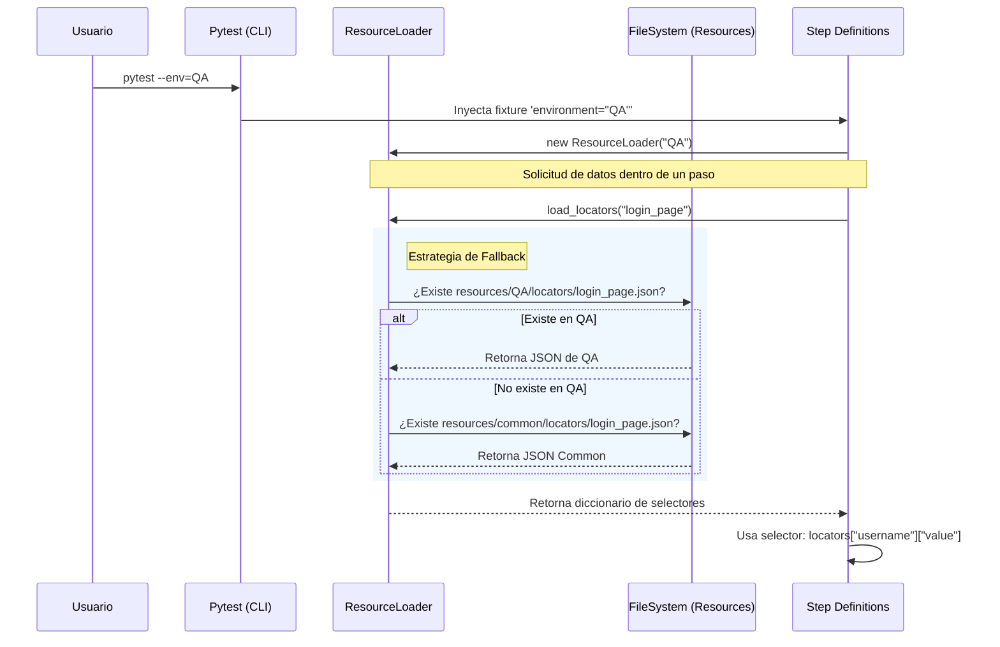

# Guía de Ejecución y Reportes

## Ejecución de Tests

### Ejecutar Todos los Tests
```bash
pytest
```

### Selección de Entorno
Por defecto, los tests se ejecutan contra **DEV**. Puedes cambiar el entorno con la bandera `--env`:

```bash
# Ejecutar contra QA
pytest --env=QA

# Ejecutar contra Staging
pytest --env=STAG

# Ejecutar contra Pre-Producción
pytest --env=PP
```

Los recursos (selectores, usuarios, datos) se cargarán automáticamente desde la carpeta `resources/<ENV>/`.
```

Los recursos (selectores, usuarios, datos) se cargarán automáticamente desde la carpeta `resources/<ENV>/`.

---

## 📦 Gestión de Recursos y Variables

El framework utiliza un `ResourceLoader` inteligente para cargar configuraciones dinámicamente según el entorno seleccionado.

### Diagrama de Secuencia

El siguiente diagrama muestra cómo se cargan las variables desde que ejecutas el test hasta que se usan en el código:



### Uso desde Gherkin y Tests

Aunque los archivos `.feature` definen el **comportamiento** en lenguaje natural, la vinculación con los datos ocurre en los **step definitions** (Python).

#### 1. Definir el escenario en Gherkin (.feature)
Usa nombres abstractos para los datos, no valores hardcodeados si estos cambian por entorno.

```gherkin
Scenario: Login con usuario estándar
    Given que estoy en la página de login
    When ingreso el usuario "standard_user"
    # "standard_user" es una CLAVE para buscar en resource loader, no el valor final nécessairement
```

#### 2. Resolver datos en el código (Python)
En tus funciones de prueba, usa el `ResourceLoader` para buscar el valor real asociado a esa clave.

```python
# test_login.py

@when(parsers.parse('ingreso el usuario "{user_key}"'))
def ingresar_usuario(page, environment, user_key):
    # 1. Instanciar loader
    loader = ResourceLoader(environment)
    
    # 2. Cargar datos de usuarios
    users_data = loader.load_test_data("users")
    
    # 3. Buscar el usuario específico usando la clave del feature
    # Ejemplo: user_key="standard_user" -> busca en el JSON
    user_cred = users_data[user_key]
    
    # 4. Usar los datos
    page.fill("#user-name", user_cred["username"])
```

De esta forma:
- El `.feature` es legible.
- Los datos reales (passwords, emails) están seguros en los archivos JSON de `resources/`.
- Puedes tener usuarios diferentes para QA y DEV sin cambiar el código ni el feature.

---

### Ejecutar Tests Específicos

```bash
# Tests de login
pytest tests/test_login.py

# Con verbose
pytest tests/test_login.py -v

# Con logs detallados
pytest -v --log-cli-level=DEBUG
```

### Ejecutar por Markers
Configura tus tests con markers en `pytest.ini`.

```bash
# Solo tests smoke
pytest -m smoke

# Solo tests de login
pytest -m login

# Excluir tests lentos
pytest -m "not slow"
```

**Markers Disponibles:**
- `@pytest.mark.smoke` - Tests rápidos y críticos
- `@pytest.mark.regression` - Suite completa de regresión
- `@pytest.mark.login` - Tests de autenticación
- `@pytest.mark.demo` - Tests para demos
- `@pytest.mark.slow` - Tests lentos
- `@pytest.mark.playwright` - Tests intensivos de Playwright

### Ejecutar en Paralelo
```bash
# Automático (usa todos los CPUs)
pytest -n auto

# Específico (4 workers)
pytest -n 4
```

---

## Generar Reportes Allure

### 1. Suite Unificada (Recomendado) 🚀
La forma moderna de ejecutar todo en un solo paso.

```bash
./run_suite.sh --env=DEV --open=all
```

**Este script realiza 4 tareas críticas:**
1.  **Ejecuta** los tests en el entorno seleccionado.
2.  **Crea** un directorio único con timestamp (ej. `execution-history/20231207_220000`).
3.  **Genera** ambos reportes: **Allure** (Técnico) y **Cluecumber** (Negocio/BDD).
4.  **Archiva** todos los resultados para mantener tendencias históricas.

**Características:**
- ✅ Ejecuta todos los tests
- ✅ Guarda resultados en `allure-history/` con timestamp
- ✅ Mantiene automáticamente los últimos **20 reportes**
- ✅ Genera **gráficos de tendencias** históricas
- ✅ Guarda metadata (fecha, branch, commit, usuario)
- ✅ Pregunta si deseas abrir el reporte

### 2. Ver Reportes Históricos Individuales
Lista y visualiza reportes guardados anteriormente.

```bash
./view_history.sh
```

**Qué hace:**
- 📋 Muestra lista de reportes con fecha y estado (PASSED/FAILED)
- 🔍 Permite seleccionar cualquier reporte anterior
- 📊 Abre el reporte histórico seleccionado

### 3. Ver Tendencias y Estadísticas Históricas 🆕
Genera un resumen estadístico consolidado.

```bash
./view_historical_trends.sh
```

**Qué muestra:**
- 📊 **Tabla estadística** en consola con todas las ejecuciones
- 📈 **Gráficos de tendencias** consolidados (últimas 10 ejecuciones)
- ✅ **Tasa de éxito** general de tests
- 🎯 **Identificación de tests inestables** (flaky tests)

### 4. Script Simple (Sin Historial)
Solo genera y abre el reporte de la última ejecución en `allure-results`.

```bash
./generate_report.sh
```

### 5. Comandos Manuales
```bash
# 1. Ejecutar tests (genera allure-results/)
pytest

# 2. Generar y abrir reporte
allure serve allure-results

# O generar reporte estático
allure generate allure-results -o allure-report --clean
```
